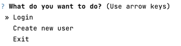
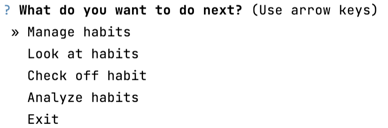

# My Habit Tracker Project

The habit tracker can be used to monitor and manage your habits by enabling you to define habits of various types and document their execution at any point in time. After a habit has been executed for the first time, it is also possible to display useful statistics for that habit that can motivate you to complete the habit more often. By providing login and registration features, It is also possible to manage the habits of several users. 

## What is it?

With the habit tracker, it is possible to monitor and manage your habits. For this purpose, four different **types** (periodicities) **of habits** are available for selection:
- Daily habits: habits that you want to perform once a day 
- Weekly habits: habits that you want to perform once per calendar week (from Monday to Sunday)
- Monthly habits: habits that you want to perform once per calendar month (from the first day of a month to the last day)
- Yearly habits: habits that you want to perform once per calendar year

After defining your habits, you can start **tracking** them by documenting in the app when you complete a habit. If you forget to check off your habit in the app right away, don't worry! The habit tracker also provides you with the possibility to select the previous five days as time of check-off. 

Not only can you define, manage and track your habits, you can also **analyze** your tracked habits by answering the following questions you might have:
- What is my current streak, i.e., the number of consecutive time periods (e.g., days for daily habits) in which I completed the habit?
- What is my best streak? 
- When was the last time I completed the habit? 
- What is the percentage of time periods in the last four weeks in which I completed the habit, i.e., what is my completion rate for this habit? (only available for daily and weekly habits)
- How often did I break habit streaks since the first completion? 

It is also possible to **compare** these statistics for all habits. Additionally when analyzing all habits at once, the following questions can be answered:
- What is my longest streak across all habits? 
- Which habit is my best habit, i.e., the habit with the longest streak? 
- What is my lowest completion rate across all habits? 
- Which habit is my worst habit, i.e., the habit with the lowest completion rate?

Besides these statistics, you also have the ability to display all your habits together with the time you created them. If you don't want to see all the habits at once, you can also filter by a specific periodicity and view only habits of the filtered periodicity. 

## Installation

- fork and clone the repo

```shell
git clone https://github.com/yourgithubusername/habitist-streak
```

```shell
pip install -r requirements.txt
```

## Usage

To start the habit tracker, run the following command.

```shell
python main.py
```

After installing and launching the app, you will first be presented with the welcome screen, where you have the option to either login or create a new user. If you are using the app for the first time, you will need to create a new user to be able to login. Once you have chosen a valid username, you will be automatically logged into the system and can start tracking your habits. However, please note down your username, as there is no way to retrieve it later if you forget it.



Once logged in, you can start managing and tracking your habits by first creating new habits and then checking them off after you have completed them. If you no longer need a habit, you can simply delete it in the "Manage habits" menu. If you want to rename a habit or change its periodicity, just select "Modify habit" in the "Manage habits" menu and follow the instructions on screen. After performing an action with the app (e.g., after analyzing a habit), you will automatically return to the action menu (see image below) to perform further actions to your liking - note that only the actions you can perform at the current time are available to you. For instance, if you don't have any habits yet, you will only be able to create habits. If you haven't checked off any habits yet, you won't see any option to analyze your habits. If you want to close the application, you can do so by selecting "Exit".  



## Tests

To test the functions of the app, you can log in using the username of four dummy users. These dummy users differ in how many habits they have already created and whether and how often they have already performed their habits. The following dummy users are available:
- HarryP: has a total of 6 habits (2 daily, 2 weekly, 1 monthly, and 1 yearly), 5 of which have already been completed several times 
- HermioneG: has 2 habits, all of which have been completed 
- RonW: has not yet created any habits 
- Voldemort: has one habit, which has not yet been completed

Additionally, the habit tracker includes a test suite to test its main features using pytest. To execute this test suite, run the following command: 

```shell
pytest .
```